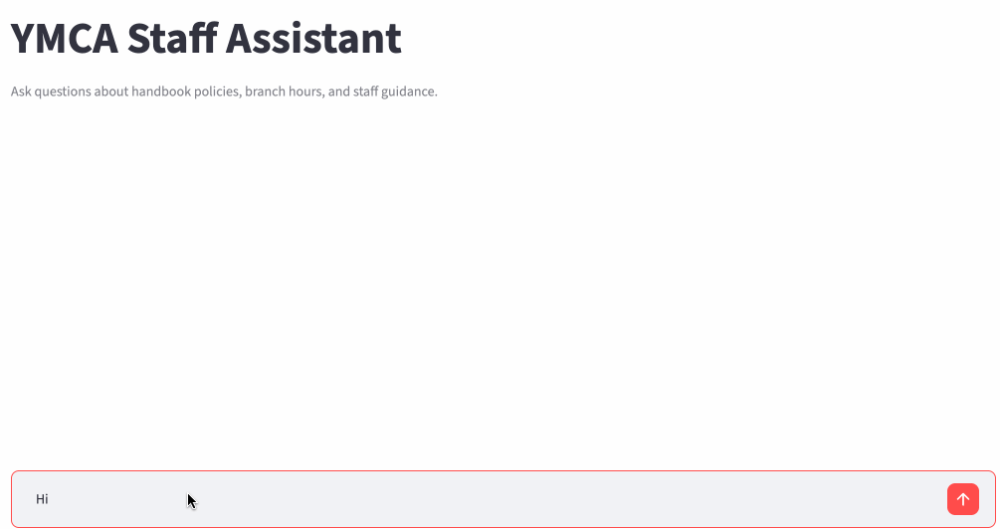

# YMCA Staff Chatbot

A RAG-powered chatbot for YMCA staff that answers handbook and policy questions using Anthropic Claude, LlamaIndex, ChromaDB, and Streamlit.

## Demo



## Features
- Ingests the local employee handbook PDF and public YMCA program/membership pages
- Extracts PDF text directly with `pypdf` for reliable, accurate content (rather than relying on generic file-type auto-detection)
- Stores and retrieves document chunks in ChromaDB using sentence-transformer embeddings
- Scope-aware retrieval that routes questions to the right source (handbook policy, public programs, or branch hours)
- Clean Streamlit chat interface for staff questions
- Hard caps on context size to keep responses fast and within model limits
- 16-test pytest suite covering retrieval scope classification and regression protection

## Setup

1. Create and activate a virtual environment:
```bash
   python -m venv .venv
   source .venv/bin/activate
```
2. Install dependencies:
```bash
   pip install -r requirements.txt
```
3. Set your Anthropic API key:
```bash
   export ANTHROPIC_API_KEY="your-key-here"
```
4. Place handbook files in the `docs/` directory. (Not included in this repo — handbook contents are internal to the organization.)
5. Run the ingestion script:
```bash
   python ingest.py
```
6. Start the app:
```bash
   python -m streamlit run app.py
```

## Updating policies and hours

When branch hours or policies change, update the source documents in the `docs/` folder or the website source, then rerun the ingestion step so the new information replaces the old content in the knowledge base.

## Testing

Run the tests with:
```bash
pytest
```

## Tech stack

Claude API (claude-haiku-4-5), LlamaIndex, ChromaDB, sentence-transformers, Streamlit, pypdf
